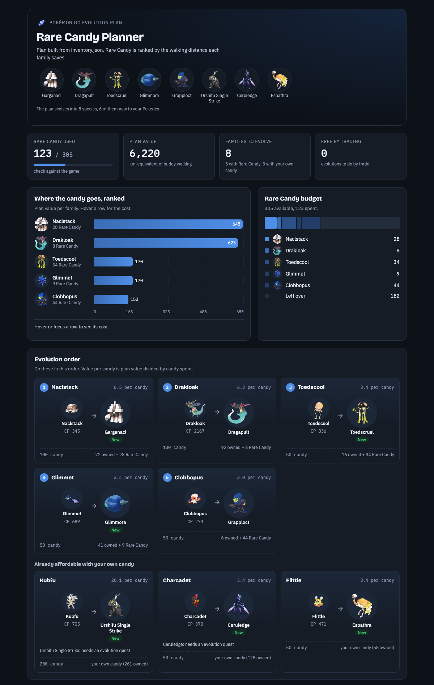

# pogo-evo-planner

[](https://github.com/kaustubhagarwal18/pogo-evo-planner/actions/workflows/ci.yml)

[](LICENSE)
[](https://github.com/astral-sh/ruff)


Tells a Pokémon GO player which evolutions to do and where their Rare Candy saves the
most effort, from screenshots and a screen recording of their own game.

```
screenshot of item bag ─┐                                         ┌─► text report
                        ├─► scan (OCR) ─► inventory.json ─► plan ─┤
screen recording ───────┘                 (review/edit)           └─► HTML dashboard
```

It never logs in to or talks to the game servers, and never taps or swipes in the game.
The player moves through their own screens; this only reads them. That is the same line
long-running scanner apps stay behind, and it keeps accounts safe from Terms of Service bans.

## Quick start

Requires Python 3.10+. Use a virtualenv (activate it in every new terminal):

```bash
python3.14 -m venv .venv    # any Python >= 3.10
source .venv/bin/activate
```

Then:

```bash
make install-ocr        # pip install -e '.[ocr,dev]'  (RapidOCR + RapidFuzz)
make gamemaster         # latest datamined game data -> data/latest.json

pogo-evo-planner scan bag.png recording.mp4 -o inventory.json --species data/latest.json
# review inventory.json, add evolution items under "items", then:
pogo-evo-planner plan inventory.json --species data/latest.json

# same plan as a self-contained HTML page (ranking, candy budget, paths, inventory):
pogo-evo-planner dashboard inventory.json --species data/latest.json -o dashboard.html --open
```

`pogo-evo-planner scan ... --dashboard dashboard.html` scans and writes the dashboard in one go.

Always pass `--species data/latest.json` when scanning. Without it the scanner matches names
against the small bundled sample, and every species missing from it (all of Paldea, for
example) is silently dropped.

Scanning took about 1.5 s per frame with RapidOCR on an Apple Silicon laptop. A recording is sampled at
3 fps, so a few minutes of scrolling can take 10+ minutes to scan. `--fps 1` is about three times
faster but can miss screens you scroll past quickly. Once `inventory.json` exists, `plan` and
`dashboard` run in about a second; no need to rescan.

No RapidOCR? `make install` uses Tesseract (`apt install tesseract-ocr` /
`brew install tesseract`) and Python's difflib instead: slower, less accurate.

Try it without the game, from a fresh terminal:

```bash
cd /path/to/pogo-evo-planner
source .venv/bin/activate
make demo    # planner on an example inventory
make mock    # renders synthetic screens and a recording, scans them, plans
```

See [docs/CAPTURING.md](docs/CAPTURING.md) for what to record.

## Example output

```
Rare candy: using 150 of 150  (value score 13,392)

== Spend rare candy on ==
Feebas family: 100 candy (30 owned + 70 rare) - saves ~1,400 km of buddy walking
   Feebas -> Milotic  [#5 88.9%]
      Milotic: walk 20 km as buddy first
Dratini family: 100 candy (60 owned + 40 rare) - saves ~200 km of buddy walking
   Dragonair -> Dragonite  [#2 93.3%]
...
== Trade instead of spending candy ==
   Haunter -> Gengar is free when traded (from Haunter #9)
```

## Example dashboard (a real recording)

`pogo-evo-planner dashboard` on a real scan: one bag screenshot plus a screen recording of storage
and detail pages (424 frames, 169 Pokémon read).

> **Partial collection.** Not all of the player's Pokémon were recorded, so this plan only
> covers the ones in the recording. Pokémon that weren't scrolled past are missing (a Maushold
> was added by hand). 14 recorded families have no candy count, but none of them can evolve into
> a species the player doesn't have, so they don't affect this plan. The plan will change as more
> of the collection is recorded.



| Rare Candy | Evolution | Candy needed (owned + Rare) |
|---|---|---|
| 28 | Naclstack → Garganacl | 100 (72 + 28) |
| 8 | Drakloak → Dragapult | 100 (92 + 8) |
| 44 | Clobbopus → Grapploct | 50 (6 + 44) |
| 34 | Toedscool → Toedscruel | 50 (16 + 34) |
| 9 | Glimmet → Glimmora | 50 (41 + 9) |
| 0 | Kubfu → Urshifu, Charcadet → Ceruledge, Flittle → Espathra | own candy only |

Every one is a species the player doesn't have yet; 182 Rare Candy is left unspent rather than
used on repeats. The Evolve buttons confirm four of the targets were never caught (Garganacl,
Glimmora, Toedscruel, Espathra). The scan's manual fixes before this result: removed a Kubfu
that was really a Kleavor's CP, added three candy counts and the missing Maushold.

## How it works

Full walkthrough, with diagrams, of how missing species are found and how evolutions are
ranked: [docs/ARCHITECTURE.md](docs/ARCHITECTURE.md).

### Scanning (`pogo_evo_planner/scan/`)

| Step | Module | Notes |
|---|---|---|
| Frames | `frames.py` | Samples recordings at 3 fps, collapses pauses into one sharpest frame, keeps every scroll frame. |
| OCR | `ocr.py` | RapidOCR (PaddleOCR models on ONNX) by default; Tesseract fallback reads 3 passes (2 polarities + upscaled) and merges. Returns word boxes. |
| Screens | `screens.py` | Classifies each frame (bag / detail / Pokédex / storage) and parses it relative to labels the game always shows, not fixed pixel regions. Species names are fuzzy-matched. |
| Merge | `pipeline.py` | Votes across frames, de-duplicates storage cells by (species, CP), reports conflicts and gaps. |

What each screen provides:

- **Item bag** → Rare Candy count (ignores Rare Candy XL).
- **Pokémon detail page** → that family's candy (`60` above `DRATINI CANDY`). Neither the
  storage grid nor the Pokédex shows candy, so one detail page per family is needed. The
  Candy XL count beside it is ignored, including on narrow phones where its label wraps
  onto two lines. The **Evolve button** also shows whether you've ever caught the evolution:
  a dark silhouette means never caught, colour means caught. A silhouette is saved under
  `not_caught` and overrides a storage reading of that species (the grid sometimes pairs a
  name with the wrong cell). A species counts as caught if any frame shows it in colour, so
  one misread frame (a green Pokémon on the green button, a sprite caught mid-swipe) is
  outvoted. Read for single-evolution species on green buttons; the grey button shown when you
  can't afford it is reported as unknown for now.
- **Storage grid** → owned species and CP per cell. A cell whose CP is scrolled off is
  skipped; another frame will have it whole.
- **Pokédex** → caught vs. only-seen, by sprite colour above the dex number. Not yet tried on
  a real Pokédex recording. Next iteration: apply the Evolve button's silhouette test to a
  Pokédex scroll to get never-caught for every species at once (see the roadmap).

### Planning (`pogo_evo_planner/planner.py`)

- Cost per candy = buddy km × rarity multiplier (`data/rarity_tiers.json`, hand-tuned:
  spawn rarity isn't in the game data).
- An evolution is worth candy cost × cost per candy, plus a bonus for a new Pokédex entry,
  but only when it gives you a species you don't already own. That value is the same however
  the species is reached (the candy from the family's first stage), so evolving a middle stage
  you own beats starting over from the first stage. Owning a later stage counts as having
  the earlier ones, and a plain name like Maushold covers all its forms (the storage grid
  never shows the form). Rare Candy is only spent to complete an evolution into a species you don't
  have, never on a repeat and never just to use it up; repeats only use own candy left over
  after that. A repeat evolution is worth
  nothing by default (`--repeat-value 0.1` keeps 10%, `1` turns the discount off). Species
  you own count as registered.
- Per family, a DP over owned specimens and their evolution paths (multi-step, branched)
  gives (candy needed, items used, value) options. Across families, a grouped knapsack
  spends the Rare Candy and shared items (Metal Coat, Sinnoh Stone, lures) for maximum value.
- Partial top-ups are never suggested: Rare Candy only pays off when it completes an
  evolution. Trade evolutions are listed as "trade instead". Verified against brute force.

### Dashboard (`pogo_evo_planner/dashboard.py`)

Renders the same plan as one self-contained HTML file from `pogo_evo_planner/data/dashboard.html`:
the species the plan evolves into, summary, families ranked by value, the Rare Candy budget,
evolution order (with a "New" tag where an evolution adds a Pokédex entry), trades, skipped
Pokémon, and the scanned inventory, filterable by what the plan does to each. It flags families
whose candy count wasn't scanned. Pokémon sprites and artwork load from
[PokeAPI's sprite repository](https://github.com/PokeAPI/sprites) by national dex number when
online; offline, each shows its initial instead. The file lists your Pokémon, so it is gitignored
like `inventory.json`.

## Data

- `pogo_evo_planner/data/species_sample.json`: ~65 hand-entered species for tests and demos.
  **Not authoritative**; use `make gamemaster` for real data.
- `scripts/fetch_gamemaster.sh`: downloads PokeMiners' datamined `latest.json`;
  `gamemaster.py` parses it (candy cost, buddy km, items, lures, trade flags, conditions).

## Status

MVP. The planner is solid. The scanner's automated tests use **synthetic** screens
(`tests/mockscreens.py`), which mimic the text layout but aren't real captures. A first real
recording (576×1296 phone screen) found two problems, both fixed: unknown species being dropped
with the sample data, and the wrapped Candy XL label being read as regular candy. It also led to
the Evolve-button silhouette check. Expect more calibration on other phones; OCR still garbles
some CP values and the storage grid sometimes pairs a name with a neighbouring cell's CP. See
[docs/ROADMAP.md](docs/ROADMAP.md).

## Development

```bash
make test        # all tests incl. end-to-end OCR (~30 s)
make test-fast   # skips the OCR end-to-end test
make lint
```

CI (`.github/workflows/ci.yml`) runs the suite with the Tesseract backend on Python
3.10–3.13, plus a non-blocking RapidOCR job.

Not affiliated with Niantic, Scopely, Nintendo or The Pokémon Company.
