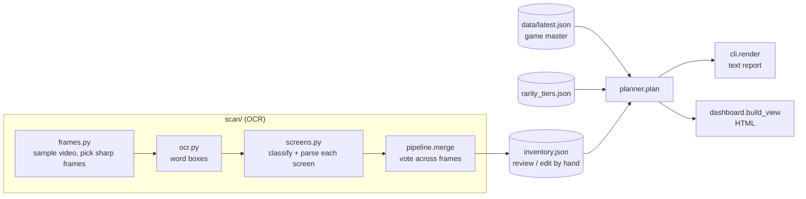
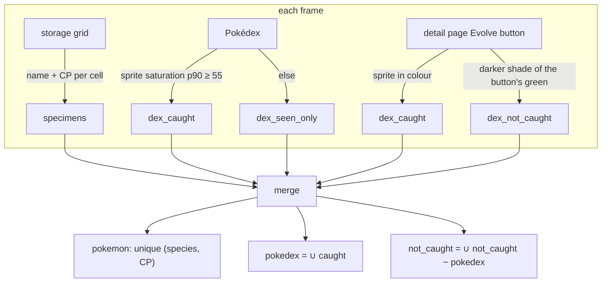
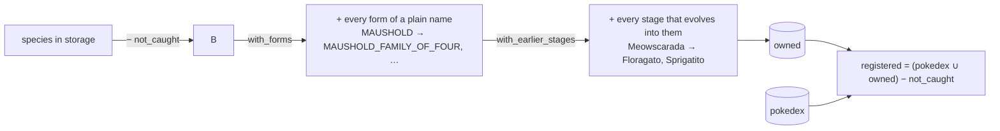
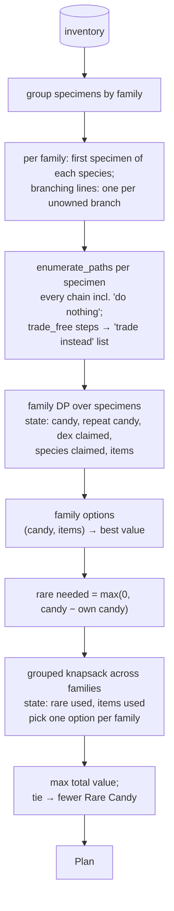

# Architecture

How `pogo-evo-planner` turns screens into a ranked evolution plan, focused on the two parts
that decide the result: **finding what the player is missing** and **ranking what to evolve**.
The README's "How it works" section is the short version; this is the long one.



Every arrow after `inventory.json` is deterministic and runs in about a second, so the
planner can be re-run after hand edits without rescanning.

## 1. Inputs

| Field in `inventory.json` | Comes from | Meaning |
|---|---|---|
| `rare_candy` | item bag screen | Rare Candy held (Candy XL ignored) |
| `candy` | Pokémon detail page, one per family | candy per family, keyed by first stage (`DRATINI`) |
| `pokemon` | storage grid | owned specimens (species + CP) |
| `pokedex` | Pokédex screen, coloured Evolve buttons | species ever caught |
| `pokedex_seen_only` | Pokédex screen | seen but never caught (informational) |
| `not_caught` | silhouette on an Evolve button | species never caught; overrides storage |
| `items` | typed by hand | evolution items (Metal Coat, Sinnoh Stone, lures) |

The species table (`gamemaster.py`) supplies each species' family, dex number, buddy km,
evolutions (candy, item, notes, `trade_free`) and rarity class.

## 2. Finding what's missing

"Missing" means two different things, and the planner rewards them separately:

- **Not owned:** no specimen of that species in storage. Evolving into it earns the species
  value (the candy it stands for).
- **Not registered:** never caught, so not in the Pokédex. Evolving into it also earns the
  Pokédex bonus.

A species can be registered but not owned (caught once, since transferred or evolved).
Evolving into it then earns the species value but no Pokédex bonus.

### 2a. Evidence from the screens (`scan/`)



- `screens.evolve_sprite_caught` checks the sprite left of the EVOLVE label: a silhouette
  is a mid-dark green and never near-black, so a dark Pokémon in colour (Kilowattrel) still
  counts as caught. It returns `None` (unknown) on the grey "can't afford" button.
- `merge` lets one coloured reading anywhere beat any number of silhouettes
  (`not_caught − caught`), so a single misread frame can't mark a species missing.
- Storage cells are de-duplicated by `(species, CP)`. Cells read without a CP are counted
  per frame and only added beyond what CP-bearing cells already cover.
- If a species is both in storage and in `not_caught`, the scan warns that the grid probably
  paired a name with the wrong cell. The planner trusts the silhouette.

### 2b. Owned and registered sets (`planner.py`)



- `with_forms`: the storage grid never shows a form, so a plain name covers every form with
  the same dex number. A specific form (`OINKOLOGNE_FEMALE`) covers only itself.
- `with_earlier_stages`: owning a later stage implies you had the earlier ones, so evolving
  into them isn't new.

### 2c. Gaps in the data

These don't change the plan by themselves. They're reported so the player can fill them in:

| Check | Where | Triggers when |
|---|---|---|
| `families_missing_candy` | planner, used by scan and dashboard | a family has no candy count **and** an owned member can still evolve, at any depth, into a species not in `owned`. Families that can't reach anything new are left out because their candy doesn't matter. |
| `unknown_species` | `plan()` | a scanned species isn't in the species table (usually because the bundled sample was used instead of `data/latest.json`) |
| storage vs. silhouette | `scan()` | covered in 2a |
| no bag screen | `scan()` | Rare Candy defaults to 0 |

## 3. Valuing an evolution

All value is in **km-equivalent effort**: how far you'd walk a buddy to earn the same candy.

```
cost_per_candy(family) = buddy_km × rarity multiplier
```

The multiplier comes from `pogo_evo_planner/data/rarity_tiers.json` (or `--tiers`): common 1, uncommon 1.5, rare 3,
very rare 5, legendary 10. Families not listed there fall back to legendary if the game data
marks them legendary or mythical, and to common otherwise. Spawn rarity isn't in the game
data, so the tiers are set by hand.

For one evolution path (a specimen and the chain of steps it takes):

| Term | Value | Condition |
|---|---|---|
| species value | `candy_from_base(final) × cost_per_candy` | the final species isn't in `owned` and nothing else in this family already claimed it |
| repeat value | `path candy × cost_per_candy × repeat_value` (0 by default) | otherwise; only own candy may pay for it |
| Pokédex bonus | `dex_bonus` (20) per new entry | each species on the path not in `registered` and not already counted in this family |

`candy_from_base` is the cheapest candy from the family's first stage to that species. The
species value is the same however the species is reached, so finishing from an owned middle
stage costs less candy for the same value, and the cheaper route wins.

Worked examples from a real scan (all rarity tier common, multiplier 1):

| Family | Evolution | Candy spent | Target owned? | Registered? | Value |
|---|---|---|---|---|---|
| Nacli | Naclstack → Garganacl | 100 | no | no (silhouette) | 125 × 5 + 20 = **645** |
| Dreepy | Drakloak → Dragapult | 100 | no | yes | 125 × 5 = **625** |
| Toedscool | Toedscool → Toedscruel | 50 | no | no (silhouette) | 50 × 3 + 20 = **170** |
| Clobbopus | Clobbopus → Grapploct | 50 | no | yes | 50 × 3 = **150** |

Garganacl spends 100 candy but is valued at 125, because reaching it from Nacli would cost
125.

## 4. Ranking: choosing what to evolve

The choice is an exact optimisation, not a greedy sort, in two stages.



### 4a. Per family (`family_options`)

1. `keep_specimens` keeps one specimen per species, the first listed, and drops later
   duplicates. A species whose line branches (Eevee; Kirlia → Gardevoir or Gallade; Charcadet →
   Armarouge or Ceruledge) keeps one copy per final evolution you don't own yet, so each copy can
   take a different branch. This keeps the DP small. IVs are ignored. Worst case: 8 Eevees with
   lures and no Eeveelutions owned takes about 6 s; a typical inventory plans in under a second.
2. `enumerate_paths` lists every path from each specimen, including multi-step and branched
   ones, plus the empty path. Steps marked `trade_free` are not taken; they go to the
   "trade instead" list (unless `allow_trade_evolutions`).
3. The DP adds specimens one at a time. Each path can be scored as a repeat or, if its final
   species is unowned and unclaimed, as a new species. States that exceed own candy + Rare
   Candy or the items held are dropped.
4. At the end, a state is discarded if its repeat candy is more than the own candy the new
   evolutions leave over. This is the rule that **Rare Candy is never spent on a repeat**.
5. The best value is kept for each `(candy, items)` pair. Those pairs are the family's options.

### 4b. Across families (`plan`)

Each option needs `max(0, candy − own candy)` Rare Candy. A grouped knapsack takes one
option per family (the empty option is always available), with total Rare Candy ≤ what's held
and shared items within stock. It returns the state with the highest total value and, on a
tie, the one using less Rare Candy.

Because value only comes from completing an evolution, the optimiser never suggests a
partial top-up and never spends Rare Candy just to use it up. In the real scan above it
used 123 of 305 Rare Candy and left the rest.

### 4c. Presentation order

The optimiser picks the set; display order is a separate step:

| Output | Grouping | Order |
|---|---|---|
| `plan` text report (`cli.render`) | "Spend rare candy on", "Already affordable with your own candy", "Trade instead" | Rare Candy used, then value |
| dashboard (`data/dashboard.html`) | needs Rare Candy / own candy only | value, shown with value per candy |

The dashboard also shows each scanned Pokémon's status: planned evolution, trade, "Fully
evolved", "Not planned", "Not in species data", or "Probably misread" (in storage but
`not_caught`).

## 5. Settings

| Setting | Default | CLI flag | Effect |
|---|---|---|---|
| `dex_bonus` | 20 | `--dex-bonus` | km-equivalent value of a new Pokédex entry |
| `repeat_value` | 0 | `--repeat-value` | share of value kept by evolving into a species already owned |
| `allow_trade_evolutions` | off | `--allow-trade-evos` | spend candy on evolutions that are free by trading |
| `rare_candy_blocked_families` | none | — | families that may only use their own candy |

## 6. Where to look

| Concern | Code |
|---|---|
| frame sampling | [`scan/frames.py`](../pogo_evo_planner/scan/frames.py) |
| screen parsing, Evolve-button and Pokédex colour tests | [`scan/screens.py`](../pogo_evo_planner/scan/screens.py) |
| merging frames, scan warnings | [`scan/pipeline.py`](../pogo_evo_planner/scan/pipeline.py) |
| owned / registered sets, valuation, DP, knapsack | [`planner.py`](../pogo_evo_planner/planner.py) |
| game master parsing | [`gamemaster.py`](../pogo_evo_planner/gamemaster.py) |
| text report | [`cli.py`](../pogo_evo_planner/cli.py) |
| dashboard data | [`dashboard.py`](../pogo_evo_planner/dashboard.py) |
